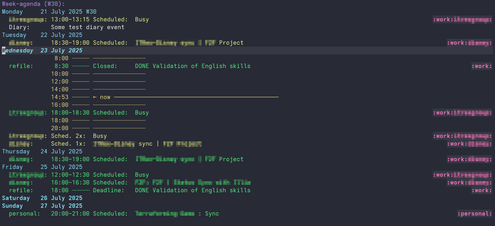

# Org Calendar Sync Tool

A synchronization tool that converts iCalendar (.ics) files to Emacs org-mode format, with automatic updates and seamless integration with org-agenda.



## Features

- **Automatic Synchronization**
  Set update intervals (hourly/daily) for each calendar
- **Smart Timezone Handling**
  Automatic conversion to local timezone with DST support
- **Multi-Calendar Management**
  Sync multiple calendars with separate org files
- **Org-Mode Native Integration**
  Directly works with org-agenda and org-capture
- **Custom Event Tagging**
  Automatic tagging based on calendar source
- **Privacy Focused**
  All processing happens locally

## Installation

### Step 1: Get the Binary

Choose **either** option:

#### Option A: Download Pre-built Binary

Download binary from Release section

``` bash
# Copy release to PATH
cp ~/downloads/org_calendar -O ~/.local/bin/org_calendar
chmod +x ~/.local/bin/org_calendar
```

#### Option B: Build from Source

##### Prerequisites

- Python 3.12+
- Poetry

``` bash
# Install build tools
# Linux
pipx install poetry

# Clone and build
git clone https://github.com/alexsherstnev/org-calendar
cd org-calendar
poetry sync
poetry install
poetry run build

# Install binary
cp dist/main ~/.local/bin/org_calendar
```

### Step 2: Install Emacs Module

Download `org-calendar-sync.el` from repository

``` bash
mkdir -p ~/.emacs.d/modules/
cp ~/downloads/org-calendar-sync.el ~/.emacs.d/modules/org-calendar-sync.el
```

### Step 3: Configure Emacs

``` emacs-lisp
;; Setup calendar sync
(use-package org-calendar-sync
  :load-path "~/.emacs.d/modules/"
  :demand t
  :init
  (setq org-calendar-configs
        `((:url "https://calendar.google.com/example/basic.ics"
           :output "~/org/calendars/example.org"
           :tags ":work:"
           :weeks 2
           :update-interval 3600)
          (:url "https://outlook.office365.com/example/calendar.ics"
           :output "~/org/calendars/outlook.org"
           :tags ":work:"
           :weeks 2
           :update-interval 3600)))
  :config
  (setup-calendar-sync-timers))

;; Configure agenda
(setq org-agenda-files (append (file-expand-wildcards "~/org/calendars/*.org")))
```
